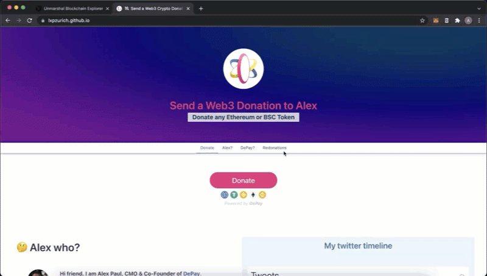

# Start accepting truly decentralized multichain Crypto donations right on GitHub

----

 

- **Demo**: https://lxpzurich.github.io
- **How-to:** [Accept Web3 Crypto Donations hosted on GitHub Pages | DePay on Medium.com](https://medium.com/depay/breakthrough-decentralized-donations-on-github-pages-da9b23994eca)

-----

I will skip a long "about me" text here. If you want to know more about me, feel free to connect on [LinkedIN](https://www.linkedin.com/in/ᥨxp/), Discord or TG.

If you identify with the values of decentralisation as much as I do, please support our Open Source Payment Protocol @DePayFi by integrating it in your projects. 

We are happy about every dev we can support. Let's buidl together 💪⚒️

- [DePay Documentation | Accept any token with on-the-fly conversion (multichain payments)](https://depay.fi/documentation)
- [Telegram Community](https://t.me/DePayFi)
- [Discord Community](https://discord.gg/gE9S4e4HFx)

# Some people claim: The "Web3" term is just hype
If you have that view, I can understand it.

As CMO of DePay, I still use the term and let people know that we are the [pioneer of Web3 payment solutions](https://depay.fi). 

Why?

Because it's hard to make a disruptive technology known and drive adoption if you don't generate visibility for it. 

I'm neutral on the Web3 term. 

But I understand you if you prefer terms that describe a technology more accurately and are not abstract inventions of investors, hype influencers or paid rappers who, far from the values of decentralisation, try to label the hard work of real BUIDLers with neologisms to profit from it. 

However - we are creating something new and are happy about everyone who is driving the future with us. And that's why I embrace any type of terminology used to describe our collective 🤗.

## Sad truth: Crypto payment providers have always been an oxymoron
You are ready for the go-live, but your dApp/Crypto still needs a solution for accepting Crypto payments. 

At this point, many people don't realise that the integration of common payment solutions **will cause the degree of decentralisation of their project to plummet** - probably at a very early stage of your project which was initially meant to be a driver for decentralization.

The sad truth is: pretty much all the big players in the payments space are not decentralised and require the same level of trust as a traditional bank.

DePay is pioneering Crypto Payments because it's permissionless & trustless. Our widgets can be integrated into your project within minutes and the UX leaves no wishes unfulfilled

With DePay, you let your users pay with exactly the assets they have in their wallet. Our solution converts in real time any token into the one you want to receive (e.g. USDT.). 

**Convince yourself:** There is no other [altcoin payment solution](https://depay.fi) out there that can compete with DePay's level of decentralization, interoperability, UI, and simple UX.
